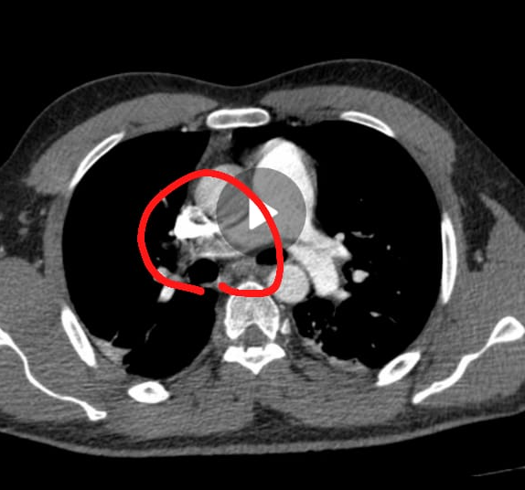

Introdução PE-predictor - Em desenvolvimento
==============================

Embolia pulmonar é a terceira causa de morte cardiovascular no mundo <a href="https://www.cardiopulmonar.com.br/noticia/embolia-pulmonar-e-a-terceira-causa-de-morte-cardiovascular-no-mundo/" > link </a> esse projeto tem como objetivo de prever um conjunto de <a href="https://en.wikipedia.org/wiki/CT_scan" > CT scans </a> que são gerados através do exame tomografia. O exame fornece as informações do paciente e pode ser visto na seguinte imagem:

<p align="center">
    
</p>

Nessa imagem é possível observar a obstrução causa por um coágulo. A ánalise foi feita pelo médico Leonardo Yuri Kasputis Zanini

<p align="center">
    
</p>


Os médicos costumam diagnosticar a embolia pulmonar procurando por uma obstrução da artéria pulmonar através da angiografia por tomografia computadorizada (TC) ou cintilografia pulmonar.

O dataset usado foi fornecido pela plataforma kaggle e pode ser baixado seguindo as instruções de uso. Nesse dataset existe um conjunto de imagens que são explorados no notebook 0.1. Com a exploração desses dados é utilizado uma rede neural <a hrref="https://arxiv.org/abs/1711.11248v3" >ResNet 3d </a>


Results
==============================
Os resultados apresentados até 05/06/2021 foram 5 horas de treinamento utilizado Tesla P100-PCIE-16GB


| Acurácia Treinamento  |  Acurácia Validação  |
| ------------------- | ------------------- |
|  71,89% |  72,22% |

Foram testado 10 epochs que podem ser conferidos no notebook 0.3

Usage
==============================
Para baixar as bibliotecas utilize o comando 
```Shell
make requirements
```

Para baixar o dataset é necessário uma conta no kaggle e digitar o seguinte comando

```c
make data
```

Para verificar se tudo ocorreu certo utilize
```c
make test_environment
```

Project Organization
------------

    ├── LICENSE
    ├── Makefile           <- Makefile with commands like `make data` or `make train`
    ├── README.md          <- The top-level README for developers using this project.
    ├── data
    │   ├── external       <- Data from third party sources.
    │   ├── interim        <- Intermediate data that has been transformed.
    │   ├── processed      <- The final, canonical data sets for modeling.
    │   └── raw            <- The original, immutable data dump.
    │
    ├── docs               <- A default Sphinx project; see sphinx-doc.org for details
    │
    ├── models             <- Trained and serialized models, model predictions, or model summaries
    │
    ├── notebooks          <- Jupyter notebooks. Naming convention is a number (for ordering),
    │                         the creator's initials, and a short `-` delimited description, e.g.
    │                         `1.0-jqp-initial-data-exploration`.
    │
    ├── references         <- Data dictionaries, manuals, and all other explanatory materials.
    │
    ├── reports            <- Generated analysis as HTML, PDF, LaTeX, etc.
    │   └── figures        <- Generated graphics and figures to be used in reporting
    │
    ├── requirements.txt   <- The requirements file for reproducing the analysis environment, e.g.
    │                         generated with `pip freeze > requirements.txt`
    │
    ├── setup.py           <- makes project pip installable (pip install -e .) so src can be imported
    ├── src                <- Source code for use in this project.
    │   ├── __init__.py    <- Makes src a Python module
    │   │
    │   ├── data           <- Scripts to download or generate data
    │   │   └── make_dataset.py
    │   │
    │   ├── features       <- Scripts to turn raw data into features for modeling
    │   │   └── build_features.py
    │   │
    │   ├── models         <- Scripts to train models and then use trained models to make
    │   │   │                 predictions
    │   │   ├── predict_model.py
    │   │   └── train_model.py
    │   │
    │   └── visualization  <- Scripts to create exploratory and results oriented visualizations
    │       └── visualize.py
    │
    └── tox.ini            <- tox file with settings for running tox; see tox.readthedocs.io


--------

<p><small>Project based on the <a target="_blank" href="https://drivendata.github.io/cookiecutter-data-science/">cookiecutter data science project template</a>. #cookiecutterdatascience</small></p>
